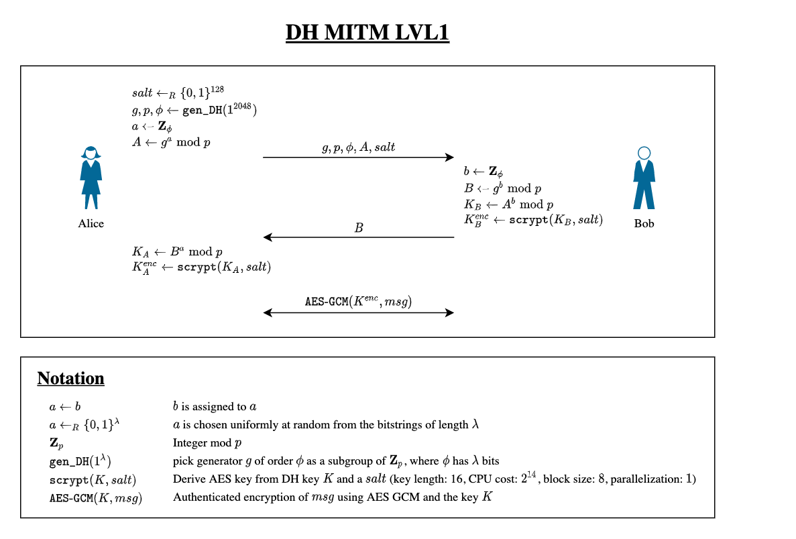

# DH MITM LVL1

## Task
In this crypto challenge, you play the role of a network level adversary and try to break a protocol based on the Diffie-Hellman key exchange protocol. Your hacker colleagues completely compromised the target network and gave you a simple tool to intercept, drop, and insert any packets in the network. Start this tool in the Resources section. It may take a moment until the website is accessible.

There are different versions of this challenge. This is level 1.

The considered protocol is described in detail in the following diagram:



The AES encryption in Python is done as follows (using the py3-pycryptodome package):

```
from Crypto.Protocol.KDF import scrypt

key_bytes   = dh_key.to_bytes((p.bit_length() + 7) // 8, "big")
aes_enc_key = scrypt(key_bytes, salt, AES_KEY_LEN, N=2**14, r=8, p=1)
cipher      = AES.new(aes_enc_key, AES.MODE_GCM)
ctxt, tag   = cipher.encrypt_and_digest(msg.encode("utf-8"))
from Crypto.Protocol.KDF import scrypt

key_bytes   = dh_key.to_bytes((p.bit_length() + 7) // 8, "big")
aes_enc_key = scrypt(key_bytes, salt, AES_KEY_LEN, N=2**14, r=8, p=1)
cipher      = AES.new(aes_enc_key, AES.MODE_GCM)
ctxt, tag   = cipher.encrypt_and_digest(msg.encode("utf-8"))
```

Goals:

 - Compromise the key exchange between Alice and Bob.
 - Decrypt the flag sent by Alice.
 - Submit flag and write-up (see below)

Flag Submission and Write-Up: To achieve full points for this challenge, submit the flag (format: UUID) and a write-up. In addition to explaining your solution, your write-up should address the following questions:

 - Which flaw in the protocol did you exploit?
 - How can this flaw be mitigated?


## Solution

Since the described protocol does not validate the identity of the other side, it can be attacked via a Man in the middle attack. For this, it's needed to drop all packages and create a new private key for Bob and Alice. With those keys, all messages can be viewed and then reencrypted with the other key. With this tactic, I was able to see all messages and Alice and Bob are not noticed, that the messages are intercepted. To make this possible, I wrote a simple python script, that generates the needed keys for the MITM Attack and is able to decrypt and re-encrypt messages.

The MITM Attack could be prevented, if both Alice and Bob identify each other, that they are really them. This can happen for example with a certificate from a trusted party or using a preshared secret (if possible).

The intercepted conversation was like this:

```
Alice: If you ask me nicely, I'll give you the flag.
Bob: Gimme that flag!
Alice: If you ask me nicely, I'll give you the flag.
Bob: Please, give send the flag!
Alice: If you ask me nicely, I'll give you the flag.
Bob: Alice, would you be so kind to send me that flag?
Alice: If you ask me nicely, I'll give you the flag.
Bob: Hi Alice, I wonder if you'd mind sending me the flag? I'd really appreciate your help.
Alice: The flag is: 33be5aad-5450-40a1-96b4-1b6456c1e64e\n
```

The full output of the "mitm tool" is attached as "output.log", containing all the exchanged messages. The script is also attached attached.
