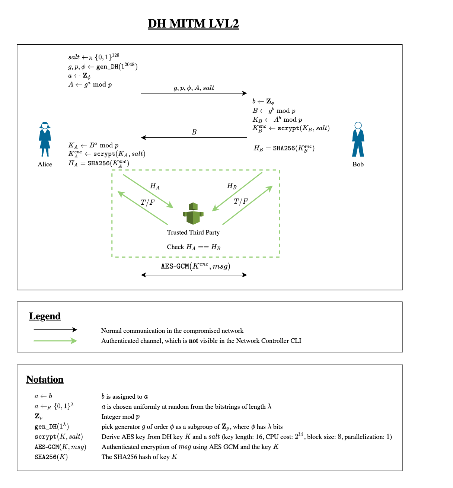

# DH MITM LVL2 by _MH_ (hard - 300 Points)

## Task
In this crypto challenge, you play the role of a network level adversary and try to break a protocol based on the Diffie-Hellman key exchange protocol. Your hacker colleagues completely compromised the target network and gave you a simple tool to intercept, drop, and insert any packets in the network. Start this tool in the Resources section. It may take a moment until the website is accessible.

There are different versions of this challenge. This is level 2.
Protocol

The considered protocol is described in detail in the following diagram:



Note that the protocol has been updated compared to LVL1. It now uses a Trusted Third Party (TTP) to over an authenticated channel that Alice and Bob agreed on the same key. This channel is shown in green on the diagram above and cannot be attacked. Nevertheless, there is still a small but powerful mistake that allows an adversary to compromise the confidentiality of this protocol. Find this special case!

The AES encryption in Python is done as follows (using the py3-pycryptodome package):

```
from Crypto.Protocol.KDF import scrypt

key_bytes   = dh_key.to_bytes((p.bit_length() + 7) // 8, "big")
aes_enc_key = scrypt(key_bytes, salt, AES_KEY_LEN, N=2**14, r=8, p=1)
cipher      = AES.new(aes_enc_key, AES.MODE_GCM)
ctxt, tag   = cipher.encrypt_and_digest(msg.encode("utf-8"))
from Crypto.Protocol.KDF import scrypt

key_bytes   = dh_key.to_bytes((p.bit_length() + 7) // 8, "big")
aes_enc_key = scrypt(key_bytes, salt, AES_KEY_LEN, N=2**14, r=8, p=1)
cipher      = AES.new(aes_enc_key, AES.MODE_GCM)
ctxt, tag   = cipher.encrypt_and_digest(msg.encode("utf-8"))
```

Goals:
- Compromise the key exchange between Alice and Bob.
- Retrieve the flag from Alice and decrypt it.
- Submit flag and write-up (see below)

Flag Submission and Write-Up:

To achieve full points for this challenge, submit the flag (format: UUID) and a write-up. In addition to explaining your solution, your write-up should address the following questions:
- Which flaw in the protocol did you exploit?
- How can this flaw be mitigated?

Acknowledgment: This challenge has been created by _MH_ from the Swiss Hacking Challenge.

# Solution

TODO

maybe this helps? http://instantlogic.net/publications/DiffieHellman.pdf
