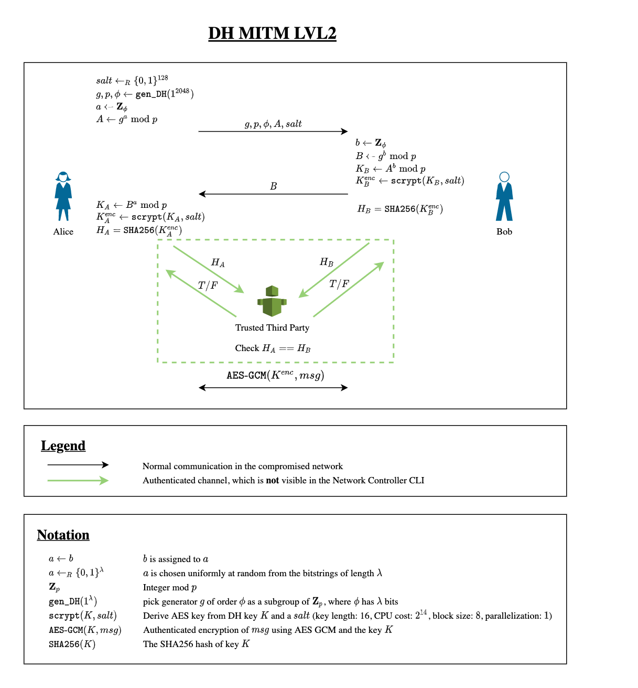

# DH MITM LVL3 by _MH_ (leet - 400 Points)

## Task
In this crypto challenge, you play the role of a network level adversary and try to break a protocol based on the Diffie-Hellman key exchange protocol. Your hacker colleagues completely compromised the target network and gave you a simple tool to intercept, drop, and insert any packets in the network. Start this tool in the Resources section. It may take a moment until the website is accessible.

There are different versions of this challenge. This is level 3.


The considered protocol is described in detail in the following diagram:



Note that this diagram is the same as for LVL2, however, the problem of LVL2 was fixed! This is not reflected in the diagram to avoid leaking the solution for LVL2. For this challenge, you need to exploit a more subtle mistake, which depends on the implementation of the above protocol. You may need a bit of group theory to solve this challenge.

Goals:

- Compromise the key exchange between Alice and Bob.
- Interact with Bob to figure out the flag.
- Submit flag and write-up (see below)

Cool Fact:

As it turns out, Diffie-Hellman parameters generated (see code below) by the widely used Python module cryptography are not secure against this attack either!

This code is vulnerable to the same attack (actually, it's even an easier version of the attack):

```
from cryptography.hazmat.backends.openssl.backend import backend as openssl_backend
from cryptography.hazmat.primitives.asymmetric import dh as dh

# Generator is often 2 or 5 (does not need to be, but doesn't matter either)
g = 2
dh_params = dh.generate_parameters(generator=g, key_size=key_size, backend=openssl_backend)
dh_nrs = dh_params.parameter_numbers()

return dh_nrs.g, dh_nrs.p, dh_nrs.p - 1
```

## Solution

I was not able to solve this challenge during the CTF...

The problem was that the parameter phi is not a prime number, but has some small
factors. This makes the prime weak for a Pollard-Rho attack. The p in the protocol
is create with "p = R*(phi) + 1" in the protocol.
