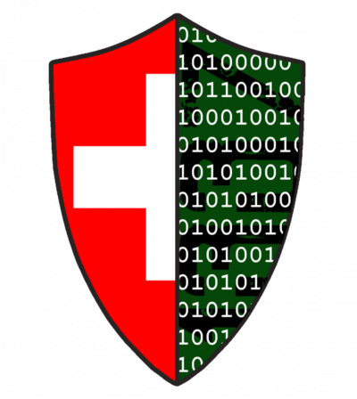

# Swiss Cyber Hacking Challange 2021

Homepage: https://www.swiss-hacking-challenge.ch/

Hacking-Lab: https://scs.hacking-lab.com/

Discord: https://discord.gg/CWGzu3Ej86

Ranking: https://ranking.scs.hacking-lab.com/

The Swiss Hacking Challenge 2021 has started on March 1st 2021 and last until May 31st 2021. You will have 3 month to complete all challenges. Top ranked players qualify for nomination to the Swiss team selection for the ECSC 2021. If you want to be always updated subscribe our mailing list.
We opened a Discord channel were you can chat / exchange with other CTF participants. Do not spoil challenge details!
Looking forward to see you at the SHC 2021.

## Final Ranking

I achieved the final rank **11** (of 235 participants) with 2900 Points (out of 3600).
